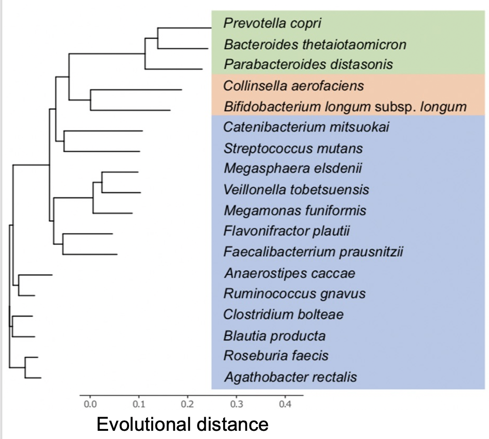
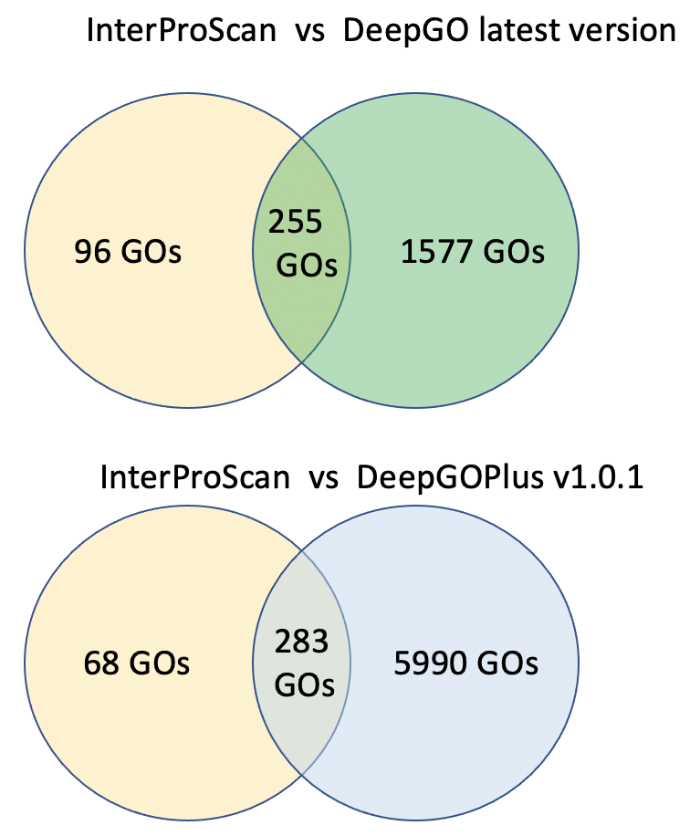
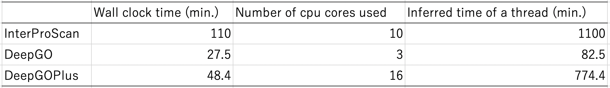

# Background

Metagenomic sequencing data contain many genes from uncultured bacteria. Functional prediction of metagenomic genes is still a challenge. In general, metagenomic gene function prediction is performed by protein sequence similarity searches against large reference protein sequence databases such as KEGG amino acid sequence database or InterPro. Protein sequence similarity searches using popular tools (e.g., DIAMOND, MMseqs2, InterProScan) with millions of query sequences take a lot of computational time and are one of the major bottlenecks in microbiome research (Mori H. et al. Bioinformatics. 2021).  
DeepGO and DeepGOPlus are deep learning based protein function prediction tools that assign Gene Ontology (GO) functions to protein sequences (Kulmanov M. et al. Bioinformatics. 2018, Kulmanov M & Hoehndorf R. Bioinformatics. 2020). DeepGOPlus combines a deep convolutional neural network (CNN) with sequence similarity-based predictions. The model combines motif-based function prediction and sequence similarity based search (if similar proteins with known functions are available). DeepGO incorporates protein structure information using ESMFold structure predictions as an additional feature, but is currently limited to predicting GO functions in the Molecular Function domain. Both DeepGO and DeepGOPlus could overcome many limitations of large-scale protein function prediction in metagenomics. The models can perform predictions with high speed, can perform genome-scale annotations, and can be used to annotate newly sequenced organisms. In this project, we apply DeepGOPlus and the latest DeepGO software for metagenome gene function prediction. 

# Outcomes

Tool evaluation using metagenomic data is usually difficult because we cannot know the true community composition of the sequence data obtained. The Mori group recently developed a new human gut mock community constructed from 18 genome-sequenced species　(Mori H. et al. DNA Res. 2023).  

The Illumina NovaSeq 6000 250 bp paired-end metagenomic sequencing data of the DNA-mix of 18 species are assembled by MEGAHIT and predicted protein-coding genes by Prodigal metagenome option. The assembly result is good (N50 104.8 kb, 7118 contigs). These contigs encode 63537 protein sequences (average 302.6 AAs).  
We compared three GO assignment methods: 
(i) InterProScan v5.62-94.0 and InterPro2GO 
(ii) DeepGOPlus v1.0.1 
(iii) DeepGO latest version (unpublished) 
by counting how many GOs are shared between methods.  

DeepGO/DeepGOPlus could assign GO functions to more than 99% of the proteins (62920/63537 proteins in DeepGO). InterProScan could assign GO functions to 53.6% of the proteins (34078/63537 proteins). 
The result of the comparison is summarized in the following Venn diagram.
The result shows that DeepGO/DeepGOPlus assigned many GOs. Mori checked some of the GO assignment results of proteins and noticed that DeepGO/DeepGOPlus tends to over-assign a wide range of related gene functions, especially enzymes.

 
The latest DeepGO is almost 10 times faster than InterProScan. 

# Future work

The computational speed of DeepGO is very good. However, replacing sequence similarity search in metagenomic analysis with DeepGO still requires careful quality assessment. DeepGO is currently working on an update of the tool's algorithm. As the next version of DeepGO will improve assignment results, further evaluation of the gene functional prediction tools is needed. 

## Acknowledgements

We would like to thank the organizers of BioHackathon 2023 for providing this hackathon opportunity. 

## References

1. Mori H, Ishikawa H, Higashi K, Kato Y, Ebisuzaki T, Kurokawa K. PZLAST: an ultra-fast amino acid sequence similarity search server against public metagenomes. Bioinformatics. 2021, 37(21):3944-3946. [https://doi.org/10.1093/bioinformatics/btab492](https://doi.org/10.1093/bioinformatics/btab492)
2. Kulmanov M, Khan MA, Hoehndorf R, Wren J. DeepGO: predicting protein functions from sequence and interactions using a deep ontology-aware classifier. Bioinformatics. 2018, 34(4):660-668. [https://doi.org/10.1093/bioinformatics/btx624](https://doi.org/10.1093/bioinformatics/btx624)
3. Kulmanov M, Hoehndorf R. DeepGOPlus: improved protein function prediction from sequence. Bioinformatics. 2020, 36(2):422-429. [https://doi.org/10.1093/bioinformatics/btz595](https://doi.org/10.1093/bioinformatics/btz595)
4. Mori H, Kato T, Ozawa H, Sakamoto M, Murakami T, Taylor TD, Toyoda A, Ohkuma M, Kurokawa K, Ohno H. Assessment of metagenomic workflows using a newly constructed human gut microbiome mock community. DNA Res. 2023, 30(3):dsad010. [https://doi.org/10.1093/dnares/dsad010](https://doi.org/10.1093/dnares/dsad010).
